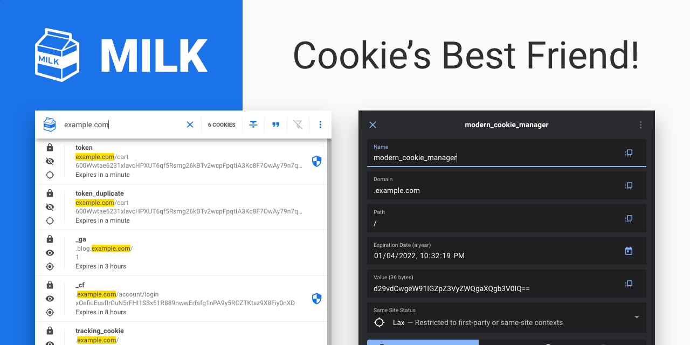

# MILK — Cookie Manager
> Cookie's best friend! Modern cookie manager.




### About

MILK is a modern cookie manager that aims to streamline the way you interact with cookies. With a modern and easy to use interface, it is easy to manage your browser's cookies. This extension comes with the following features:

- Realtime Cookie List (Updated Without Refreshing)
- Dynamically Search For Cookies
- Optionally Search Cookies With Regular Expressions
- Create, Read, Update & Delete Cookies
- Block Cookies
- Protect Cookies
- Import & Export Cookies
- Open Source Software (MIT)
- Modern UI/UX (Material Design)
- Dark / Light Theme
- Fullscreen Mode Lets You See Cookies Of Focused Tab

### Development

```shell
# Hot Reload
yarn clean
yarn install
yarn serve
```

### Package Extension

```shell
# Package Extension
yarn release
```
